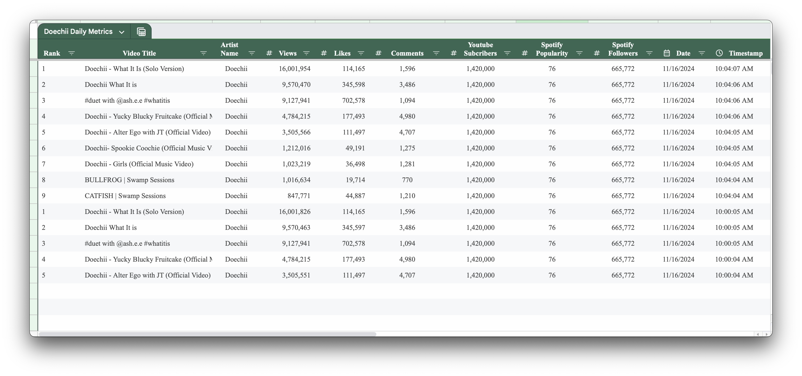
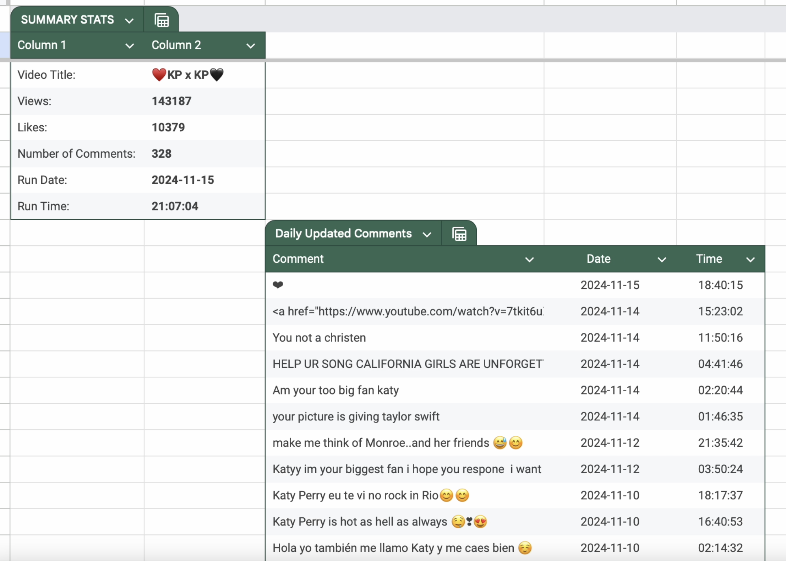
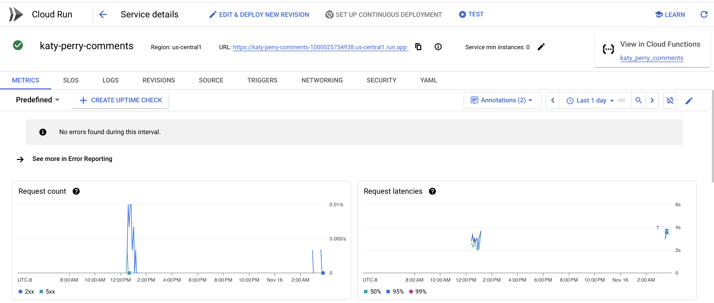
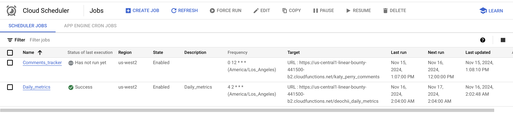

## Automated Music Metrics Tracker

### Overview

In the modern music industry, where data drives success, tracking and analyzing performance metrics is essential. This repository contains two automated solutions designed to streamline workflows for music professionals:

1. **Deochii Daily Artist Metrics Tracker**: Tracks and centralizes daily artist metrics from YouTube and Spotify.
2. **Katy Perry YouTube Comments Tracker**: Automates the tracking and storage of YouTube video comments and video metrics.

### Objective
This project leverages the **Google Cloud Console** to automate the extraction, processing, and storage of music industry performance metrics, providing real-time, actionable insights. The system uses cloud functions to interact with the **YouTube Data API** and **Spotify API**, retrieving data such as video metrics, comments, follower counts, and popularity scores. These functions process the raw data into structured, analysis-ready formats and update a centralized Google Sheet to ensure data accuracy and accessibility. Using Google Cloud Scheduler, these functions are triggered on a scheduled basis (e.g., daily), ensuring that metrics are updated automatically without manual intervention. 

*By automating this pipeline, the project eliminates manual workflows, enabling music industry professionals to monitor artist growth, audience engagement, and market trends with readily available, accessible data.*

--- 
### Tools and Technologies

#### Cloud Infrastructure:       

#### Storage and Integration:   

#### Programming and Libraries:            

#### API Interactions:   

---

### Demo Videos (Right-click to open in a new tab)

#### [Daily Metrics Demo](https://youtu.be/KiGJzic31Zo) 

#### [Comments Tracker Demo](https://youtu.be/vbNEWR7OnXg) 

--- 

### Project Steps

1. **Develop and Deploy Google Cloud Functions**  
   Python scripts were written and deployed as serverless functions on **Google Cloud Console** to interact with the YouTube Data API and Spotify API. These functions fetch comments, video metrics, and artist metrics for processing and storage.  

   

2. **Set Up Cloud Scheduler**  
   **Google Cloud Scheduler** was configured to automate the execution of cloud functions at predefined intervals (e.g., daily jobs). This ensures continuous data updates without manual intervention.  

   

3. **Store Data in Google Sheets**  
   Extracted data was automatically stored in **Google Sheets** using the `gspread` library, creating a centralized and structured format for further analysis.  

--- 

### Conclusion 

This project demonstrates the transformative power of automation in optimizing data collection and analysis processes within the music industry. Google Cloud Functions and Cloud Scheduler were used to automate the retrieval of key metrics from YouTube and Spotify, with Google Sheets centralizing the data for easy access and actionable insights. This ensures that data is readily available for actionable insights—allowing decision-makers to focus on strategy rather than manual data management.

This solution eliminates repetitive workflows while enhancing the ability to track and measure audience engagement and artist growth in real time. It showcases how technical expertise, combined with business acumen, can drive data-driven decisions in competitive markets.

As a data scientist, the focus is on designing systems that efficiently solve complex problems, scale with business needs, and deliver impactful results. This project exemplifies how strategic automation can unlock deeper insights and generate measurable value in fast-paced industries.
