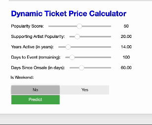
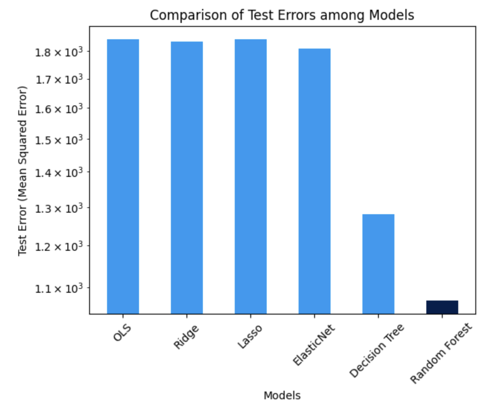

# Dynamic Concert Ticket Price Prediction Model

## Overview

In the dynamic and competitive world of live events, effective ticket pricing strategies are essential for maximizing revenue and ensuring customer satisfaction. This project introduces a machine learning-based solution to predict concert ticket prices dynamically based on key factors such as artist popularity, event timing, and ticket availability. By leveraging data-driven insights, this model empowers event organizers to implement optimal pricing strategies tailored to audience demand.

---

## Project Objective



The objective of this project is to develop and evaluate machine learning models to predict ticket prices for concerts using features such as artist attributes, event details, and ticket sales history. Through a comparison of regression models—including Ordinary Least Squares (OLS), Ridge, Lasso, ElasticNet, Decision Trees, and Random Forest—the project identifies **Decision Tree** as the most effective approach for price prediction and highlights the features with the greatest impact on pricing decisions.

---

## Key Python Packages and Tools

- **Data Manipulation and Processing**:   

- **Visualization**:  

- **Machine Learning and Statistical Analysis**:   

- **Interactive Tools**: 

---

## Project Steps

### 1. Data Loading and Preprocessing

- **Dataset**: Custom dataset containing ticket sales data, artist popularity metrics, and event timing details.
- **Preprocessing**: Handled missing values, log-transformed skewed data (e.g., follower counts), and engineered new features, such as `Log_Followers` and `Avg_Ticket_Price`.

### 2. Feature Engineering

Key features included in the analysis were:

1. **Popularity Score**: Reflects the artist’s reach and fanbase.
2. **Log Followers**: Log-transformed follower count for stability.
3. **Years Active**: Artist career duration in years.
4. **Days to Event**: Time remaining until the event.
5. **Is Weekend**: Indicator for weekend events.
6. **Supporting Artist Popularity**: Popularity of secondary artists.
7. **Total Tickets Available**: Availability influencing pricing.

### 3. Exploratory Data Analysis (EDA)

- **Feature Distributions**: Histograms for key variables, such as ticket availability and artist popularity.
- **Correlation Analysis**: Heatmaps to reveal relationships between features.
- **Day-of-Week Analysis**: Highlighted variations in ticket prices by weekdays and weekends.

### 4. Model Development and Tuning

A variety of regression models were implemented to predict average ticket prices. The model with the lowest Mean Squared Error (MSE) was selected as the final model due to its superior predictive accuracy and lower error rate, ensuring it provides the most reliable ticket price predictions.



Through hyperparameter optimization using GridSearchCV, the Random Forest model demonstrated the best balance between prediction accuracy and model robustness, making it the preferred choice for dynamic ticket pricing.

### 5. Hyperparameter Optimization

Using GridSearchCV, hyperparameters for the Random Forest model were tuned to maximize accuracy. The final model utilized the following configuration:
- `n_estimators`: 200
- `max_depth`: 20
- `min_samples_split`: 5
- `min_samples_leaf`: 1

### 6. Feature Importance Analysis

Permutation importance analysis identified the following top features influencing ticket prices:
1. Popularity Score
2. Years Active
3. Days to Event

### 7. Model Evaluation and Results

The Random Forest model emerged as the most accurate, with the following evaluation metrics:
- **Mean Squared Error (MSE)**: 870.68
- **Root Mean Squared Error (RMSE)**: 29.51
- **R² Score**: 0.5021

---

## Visual Highlights

### Feature Importance


### Model Comparison


### Residual Plot


---

## Applications and Future Work

### Applications

- **Dynamic Pricing**: Real-time ticket pricing for events based on demand and audience preferences.
- **Revenue Optimization**: Maximize earnings by identifying optimal price points.
- **Customer Insights**: Understand how artist popularity and timing influence ticket sales.

### Future Work

- Expand the dataset to include regional ticketing trends and resale data.
- Integrate real-time streaming and social media metrics to enhance predictions.
- Deploy a web application for interactive price simulations.

---

## Usage

### Prerequisites

- Python 3.x installed
- Required libraries installed via `pip install -r requirements.txt`

### Instructions

1. Clone the repository:
   ```bash
   git clone https://github.com/username/dynamic-ticket-pricing.git
