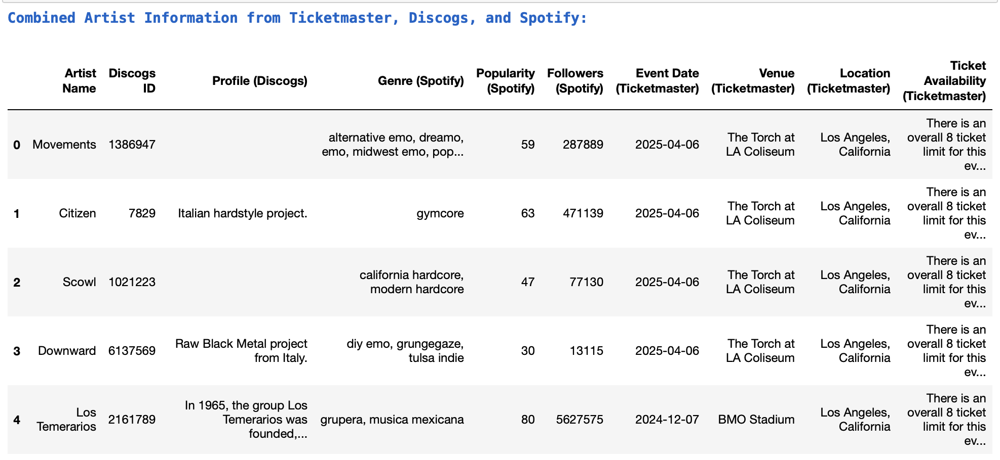

# Music Industry Data Extraction and Integration

This project streamlines data collection and analysis within the music industry through automated, multi-API integration. By consolidating diverse datasets into unified, customizable data frames, it enables efficient and repeatable insights into artist profiles, audience engagement, and event trends—empowering data-driven decision-making for industry professionals.

## Project Overview

- **Objective:**
  - Develop automated workflows to extract and standardize data from multiple APIs, creating structured data frames for in-depth analysis.
  - Enable seamless cross-platform comparisons and insights into artist popularity, audience demographics, and event engagement.
  
- **Data Sources:**
  - ** :** For artist metadata, genre classification, popularity metrics, and follower counts.
  - ** :** For extracting video statistics, engagement metrics, and audience sentiment from comments.
  - ** :** For song lyrics and metadata, supporting sentiment analysis and lyrical insights.
  - ** :** For event information, including venue details and ticket availability.
  - ** :** For artist profiles, release history, and genre categorization.

## Key Python Packages and Tools

**Data Manipulation and Management :**   

**Utility Libraries for API Interaction :**  

**Data Processing and Analysis :** 

## Extracted Data Tables

The project generates various data tables that provide in-depth insights into artist profiles, audience engagement, event information, and more. Below is a summary of the key data tables from each API, along with a **Combined Data Table** that merges insights across platforms.

### Combined Data Table (Key Feature)
The **Combined Data Table** aggregates information from multiple APIs, enabling a unified view of an artist's profile, popularity, and engagement across platforms. This table facilitates cross-platform analysis by merging key attributes from Spotify, YouTube, Genius, Ticketmaster, and Discogs into a single, cohesive dataset.

**Fields in Combined Data Table:**
- **Artist Name**: Unified artist name across APIs.
- **Spotify Data**: Includes genre, popularity score, and follower count from Spotify.
- **YouTube Data**: Combines metrics like view count, like-to-view ratio, comment-to-view ratio, and engagement metrics.
- **Genius Data**: Contains lyrical insights and artist metadata from Genius.
- **Ticketmaster Data**: Provides event dates, venue details, location, and ticket availability.
- **Discogs Data**: Adds discography details, release years, and user ratings.

This consolidated dataset empowers users to perform comprehensive analysis, enabling comparisons and trend insights across different platforms and datasets. This is particularly valuable for professionals who need a multi-dimensional view of artist performance and trends across platforms, enabling richer insights and actionable analysis.

### Individual Data Tables by API

#### Spotify API
- **Artist Data Table**: Metadata such as artist ID, name, genre, popularity, and follower count.
- **Album Data Table**: Album information including album ID, name, release date, track count, and album type.
- **Track Data Table**: Individual track details like track ID, name, duration, popularity, and playlist count.
- **Playlist Data Table**: Information on playlists featuring the artist, including playlist ID, name, owner, description, and follower count.
- **Audio Features Table**: Track-specific audio attributes such as danceability, energy, key, loudness, speechiness, and tempo.

#### YouTube API
- **Video Data Table**: Video-specific metrics including video ID, title, published date, tags, view count, like count, comment count, and engagement ratios.
- **Channel Data Table**: Insights into the artist's YouTube channel, with details on channel ID, playlists, and video count.
- **Comments Data Table**: Aggregates top-level comments for each video, capturing details such as comment ID, author name, text, like count, and publication date.

#### Genius API
- **Song Lyrics Data Table**: Lyrics and metadata for each song, including track name, full title, Genius song ID, and URL.
- **Artist Data Table**: Basic artist metadata with information such as artist ID, name, profile URL, and follower count.

#### Ticketmaster API
- **Event Data Table**: Music event details such as event name, type, date, time, venue, city, state, country, and ticket pricing.
- **Venue Data Table**: Venue-specific information such as name, location, accessibility, general rules, and child policies.
- **Event Classification Table**: Contains event classifications like genre, segment, sub-genre, and type.

#### Discogs API
- **Artist Data Table**: Artist metadata including name, profile, genres, styles, and URLs.
- **Releases Data Table**: Information on the artist's releases, including title, format, year, label, and user rating.
- **Label Data Table**: Details on labels associated with each release, with fields for release title, label name, catalog number, and release year.

### Individual Data Tables by API

| API          | Table Name                 | Columns                                                                                                    |
|--------------|----------------------------|------------------------------------------------------------------------------------------------------------|
| **Spotify**  | Artist Data Table          | Artist ID, Name, Genres, Popularity, Followers                                                             |
|              | Album Data Table           | Album ID, Album Name, Release Date, Total Tracks, Album Type                                               |
|              | Track Data Table           | Track ID, Track Name, Duration (ms), Explicit, Track Number, Popularity, Playlist Count, Preview URL       |
|              | Playlist Data Table        | Playlist ID, Name, Owner, Description, Total Tracks, Followers, Collaborative, Public                      |
|              | Audio Features Table       | Track ID, Track Name, Danceability, Energy, Key, Loudness, Speechiness, Acousticness, Instrumentalness, Liveness, Valence, Tempo, Duration (ms) |
| **YouTube**  | Video Data Table           | Video ID, Title, Published Date, Tags, Category ID, View Count, Like Count, Comment Count, Like-to-View Ratio, Comment-to-View Ratio, Duration |
|              | Channel Data Table         | Channel ID, Playlist Titles, Total Videos                                                                  |
|              | Comments Data Table        | Comment ID, Video ID, Author Display Name, Comment Text, Like Count, Published Date, Updated Date          |
| **Genius**   | Song Lyrics Data Table     | Track Name, Full Title, Lyrics, Genius Song ID, URL, Primary Artist                                        |
|              | Artist Data Table          | Artist ID, Name, Profile URL, Followers Count, Image URL                                                   |
| **Ticketmaster** | Event Data Table      | Event Name, Event Type, Date, Time, Event URL, Venue Name, City, State, Country, Min Price, Max Price, Currency, Genre, Image URL |
|              | Venue Data Table           | Venue Name, City, General Info, Child Info, Accessible Seating                                             |
|              | Event Classification Table | Event Name, Genre, Segment, SubGenre, Type                                                                 |
| **Discogs**  | Artist Data Table          | Artist Name, Profile, Genres, Styles, URLs                                                                 |
|              | Releases Data Table        | Title, Format, Year, Label, Type, Resource URL, User Rating                                                |
|              | Label Data Table           | Release Title, Label Name, Catalog Number, Year                                                            |

---

## Extracted Data Tables

The project generates various data tables that provide in-depth insights into artist profiles, audience engagement, event information, and more. Below is a summary of the key data tables from each API, along with a **Combined Data Table** that merges insights across platforms.

### Combined Data Table (Key Feature)
The **Combined Data Table** aggregates information from multiple APIs, enabling a unified view of an artist's profile, popularity, and engagement across platforms. This table facilitates cross-platform analysis by merging key attributes from Spotify, YouTube, Genius, Ticketmaster, and Discogs into a single, cohesive dataset.

| Artist Name    | Genre               | Popularity | Followers | View Count | Like-to-View Ratio | Lyrics                               | Event Date  | Venue                | User Rating |
|----------------|---------------------|------------|-----------|------------|---------------------|--------------------------------------|-------------|----------------------|-------------|
| The Beatles    | Rock, Pop           | 85         | 25000000  | 5000000    | 0.01               | "Yesterday, all my troubles..."      | 2024-05-10  | Madison Square Garden | 4.8         |

### Individual Data Tables by API

#### Spotify API

| Artist ID        | Name          | Genres           | Popularity | Followers |
|------------------|---------------|------------------|------------|-----------|
| 3WrFJ7ztbogyGnTHbHJFl2 | The Beatles   | Rock, British Invasion | 85         | 28745842  |

| Album ID         | Album Name              | Release Date | Total Tracks | Album Type |
|------------------|-------------------------|--------------|--------------|------------|
| 2K1AefZdAvHTshakGZf3hr | Abbey Road               | 1969-09-26   | 17           | album      |

| Track ID         | Track Name           | Duration (ms) | Explicit | Track Number | Popularity | Playlist Count | Preview URL |
|------------------|----------------------|---------------|----------|--------------|------------|----------------|-------------|
| 7gh6YB8fnybP6N5zBaH4 | Come Together       | 259200        | False    | 1            | 85         | 150            | [Preview Link](#) |

| Playlist ID      | Name                 | Owner         | Description        | Total Tracks | Followers | Collaborative | Public |
|------------------|----------------------|---------------|--------------------|--------------|-----------|---------------|--------|
| 37i9dQZF1DXcBWIGoYBM5M | This is The Beatles | Spotify       | Essential Beatles tracks | 50           | 3613410   | False         | True   |

| Track ID         | Track Name           | Danceability | Energy | Key | Loudness | Speechiness | Acousticness | Instrumentalness | Liveness | Valence | Tempo | Duration (ms) |
|------------------|----------------------|--------------|--------|-----|----------|-------------|--------------|-------------------|----------|---------|-------|---------------|
| 4ACVZ5p9Z0zUAZKRZPt3 | Let It Be           | 0.5          | 0.7    | 8   | -5.4      | 0.03        | 0.2          | 0.0               | 0.1      | 0.6     | 120   | 243000         |

#### YouTube API

| Video ID         | Title                     | Published Date   | Tags                 | Category ID | View Count | Like Count | Comment Count | Like-to-View Ratio | Duration |
|------------------|---------------------------|------------------|----------------------|-------------|------------|------------|---------------|---------------------|----------|
| dQw4w9WgXcQ      | Hey Jude (Remastered)     | 2024-01-20      | Beatles, Music       | 10          | 5000000    | 45000      | 1000          | 0.009               | 210      |

| Channel ID       | Playlist Titles           | Total Videos |
|------------------|---------------------------|--------------|
| UCc4K7bAqpdBP8jh1j9XZAww | Beatles Classics          | 120          |

| Comment ID       | Video ID         | Author Display Name | Comment Text                 | Like Count | Published Date   | Updated Date   |
|------------------|------------------|---------------------|------------------------------|------------|------------------|----------------|
| L1zp6zZd1O       | dQw4w9WgXcQ      | MusicFan123         | "This song never gets old!"  | 123        | 2024-01-21      | 2024-01-22     |

#### Genius API

| Track Name        | Full Title              | Lyrics                                         | Genius Song ID | URL                                | Primary Artist |
|-------------------|-------------------------|------------------------------------------------|----------------|------------------------------------|----------------|
| Yesterday         | Yesterday by The Beatles | "Yesterday, all my troubles seemed so far away" | 2236           | [Link to Lyrics](#)                | The Beatles    |

| Artist ID         | Name                    | Profile URL                | Followers Count | Image URL                 |
|-------------------|-------------------------|----------------------------|-----------------|---------------------------|
| 586               | The Beatles             | [Profile Link](#)          | 5000000         | [Image Link](#)           |

#### Ticketmaster API

| Event Name       | Event Type | Date       | Time     | Event URL            | Venue Name             | City       | State | Country | Min Price | Max Price | Currency | Genre | Image URL            |
|------------------|------------|------------|----------|-----------------------|------------------------|------------|-------|---------|-----------|-----------|----------|-------|-----------------------|
| The Beatles Tribute Show | Concert    | 2024-05-10 | 20:00    | [Event Link](#)      | Madison Square Garden  | New York   | NY    | USA     | 50        | 200       | USD      | Rock  | [Image Link](#)      |

| Venue Name       | City       | General Info                | Child Info                     | Accessible Seating |
|------------------|------------|-----------------------------|--------------------------------|---------------------|
| Madison Square Garden | New York   | No outside food allowed   | All ages allowed               | Yes                 |

| Event Name       | Genre      | Segment      | SubGenre       | Type    |
|------------------|------------|--------------|----------------|---------|
| Beatles Live     | Rock       | Music        | Classic Rock   | Concert |

#### Discogs API

| Artist Name      | Profile                                           | Genres     | Styles       | URLs                        |
|------------------|---------------------------------------------------|------------|--------------|-----------------------------|
| The Beatles      | Emerging from Liverpool, England in 1960...       | Rock       | Pop Rock     | [Link to Discogs](#)        |

| Title            | Format            | Year | Label      | Type    | Resource URL             | User Rating |
|------------------|-------------------|------|------------|---------|--------------------------|-------------|
| Abbey Road       | Vinyl, LP, Album  | 1969 | Apple Records | Album   | [Link to Discogs](#)     | 4.9         |

| Release Title    | Label Name        | Catalog Number | Year |
|------------------|-------------------|----------------|------|
| Let It Be        | Apple Records     | PCS 7096       | 1970 |

---

The **Combined Data Table** is particularly valuable for professionals who need a multi-dimensional view of artist performance and trends across platforms, enabling richer insights and actionable analysis.

