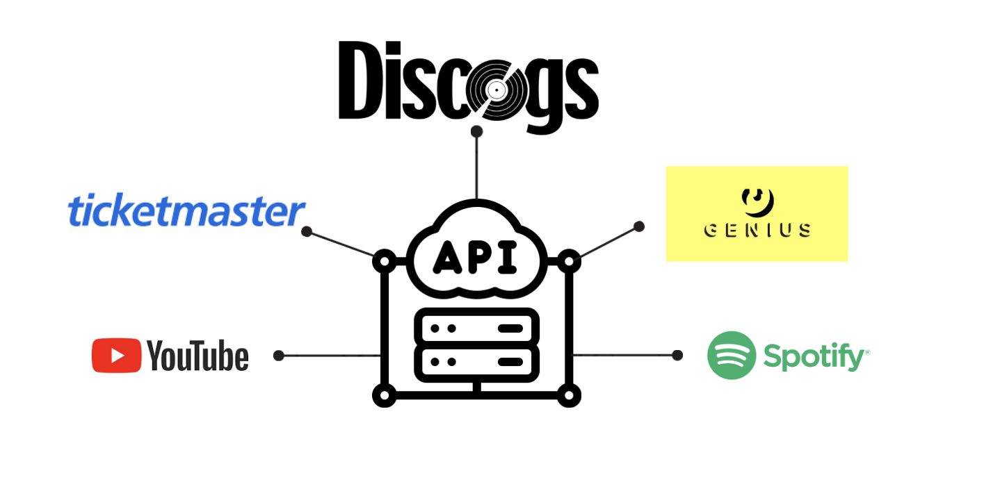

# Music Industry Data Extraction and Integration

This project streamlines data collection and analysis within the music industry through automated, multi-API integration. By consolidating diverse datasets into unified, customizable data frames, it enables efficient and repeatable insights into artist profiles, audience engagement, and event trends—empowering data-driven decision-making for industry professionals.

## Project Overview

- **Objective:**
  - Develop automated workflows to extract and standardize data from multiple APIs, creating structured data frames for in-depth analysis.
  - Enable seamless cross-platform comparisons and insights into artist popularity, audience demographics, and event engagement.
  
- **Data Sources:**
  - **Spotify API:** For artist metadata, genre classification, popularity metrics, and follower counts.
  - **YouTube API:** For extracting video statistics, engagement metrics, and audience sentiment from comments.
  - **Genius API:** For song lyrics and metadata, supporting sentiment analysis and lyrical insights.
  - **Ticketmaster API:** For event information, including venue details and ticket availability.
  - **Discogs API:** For artist profiles, release history, and genre categorization.
