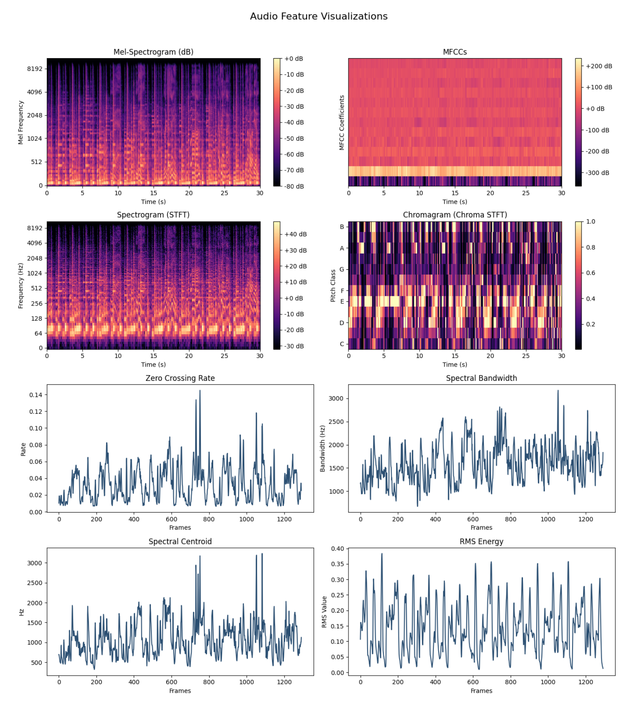
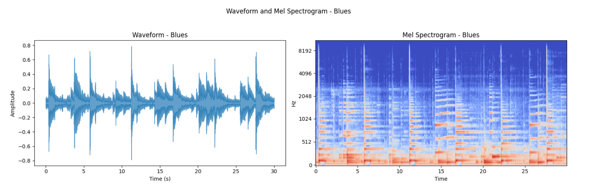
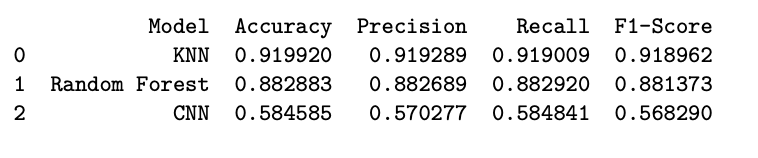
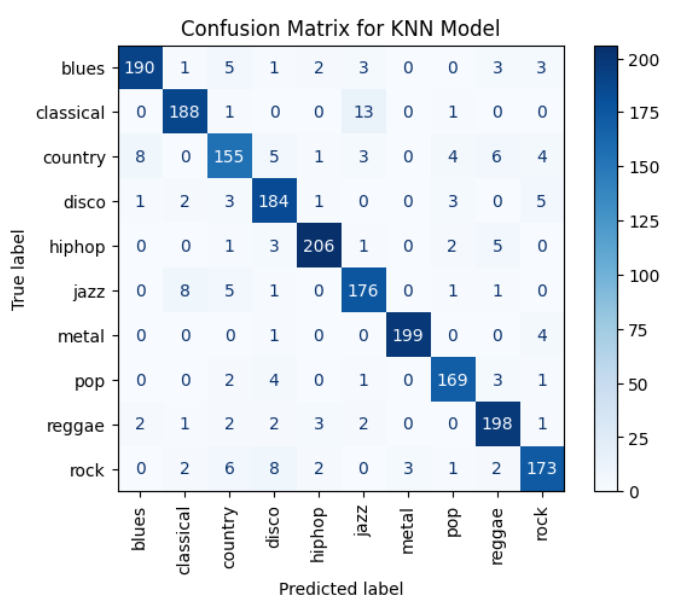
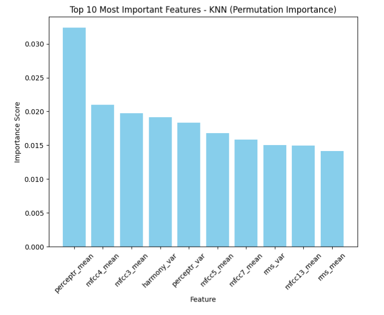

# Music Genre Classification Model

## Overview

In today’s highly competitive music industry, accurate genre classification is essential for streaming platforms, record labels, and marketers to better understand, organize, and promote musical content. By categorizing songs based on their genre, industry professionals can optimize music recommendations, enhance listener engagement, and tailor marketing strategies to target specific audience demographics. 

## Project Objective

This project explores machine learning techniques for music genre classification by leveraging models such as K-Nearest Neighbors (KNN), Random Forest, and Convolutional Neural Networks (CNN) to analyze a song’s audio features—including Mel-frequency Cepstral Coefficients (MFCCs), tempo, and spectral attributes. By evaluating the performance of these models, the project aims to identify the most effective approach for accurate genre prediction and to pinpoint key audio characteristics that influence classification accuracy.

---
### Key Python Packages and Tools

#### Data Manipulation and Cleaning:   

#### Audio Processing and Feature Extraction: 

#### Machine Learning and Model Building:    !

#### Data Visualization  

---

## Project Steps

### 1. Data Loading and Preprocessing

- **Data Source**: The GTZAN dataset, comprising pre-processed audio features and individual audio files.
- **Preprocessing**: Features were extracted using Librosa, capturing important audio characteristics such as MFCCs, chroma, and spectral attributes to create a comprehensive dataset.

### 2. Feature Selection and Visualization

Seven key features were chosen based on their role in capturing unique sound attributes:

1. **Chroma STFT**: Highlights harmonic structures.
2. **RMS Energy**: Measures intensity changes.
3. **Spectral Centroid**: Represents sound brightness.
4. **Spectral Bandwidth**: Differentiates timbral qualities.
5. **Zero Crossing Rate**: Captures noisiness.
6. **Tempo**: Essential for rhythmic patterns.
7. **MFCCs**: Encodes timbral textures across 20 coefficients.

#### Feature Visualization

To illustrate genre-specific traits, visualizations of features such as waveform and mel-spectrogram were created, revealing patterns across genres like jazz and rock.

### 3. Exploratory Data Analysis (EDA)

**Genre-Based Distribution Analysis**: Histograms of features like Acousticness and Danceability by genre revealed distinct patterns, supporting feature relevance for classification.

### 4. Model Development and Comparison

Three models (KNN, Random Forest, and CNN) were developed to evaluate genre prediction accuracy.

- **KNN**: Showed the best results for genre separation.
- **Random Forest**: Performed comparably, with high accuracy on distinctive genres.
- **CNN**: Required more complex tuning, but showed potential with further development.

### 5. Model Metrics and Evaluation

The KNN model emerged as the most effective, with high scores across accuracy, precision, and recall, making it the preferred model for genre classification. The confusion matrix below provides insights into genre-specific misclassifications, particularly in closely related genres.

### 6. Decision Boundary Visualization

The KNN decision boundaries for genre classification showcase the separation between different genres using PCA-reduced components.

### 7. Key Features for Classification

Using permutation importance, the top features contributing to genre classification were identified, highlighting the model’s reliance on attributes like MFCC and spectral features.

---

## Conclusion and Applications

The KNN model demonstrated its effectiveness in genre classification, supporting applications in music recommendation systems, playlist curation, and marketing. This model’s adaptability allows it to be leveraged across the music industry, enhancing the listening experience and operational efficiency in music categorization.
