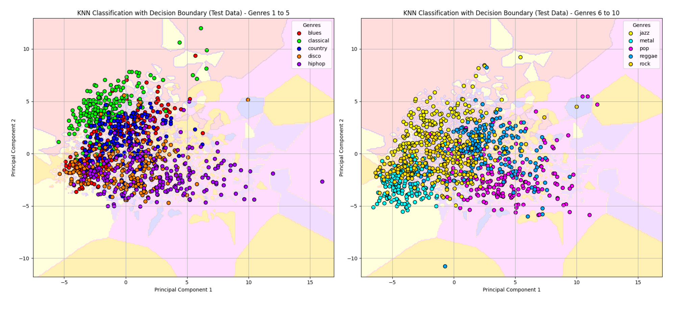

# Music Genre Classification Model

## Overview

In an era of vast musical diversity, genre classification is essential for streaming platforms and record labels to organize, recommend, and market songs. This project presents a K-Nearest Neighbors (KNN) model for predicting a song’s genre based on a wide array of musical features like MFCCs, tempo, and spectral attributes. The model aids in identifying genre characteristics, providing insights into audio features that influence classification accuracy.

## Project Objective

Develop a robust music genre classification model using KNN, Random Forest, and CNN to evaluate the impact of audio features on genre prediction.

---

## Project Steps

### 1. Data Loading and Preprocessing

- **Data Source**: The GTZAN dataset, comprising pre-processed audio features and individual audio files.
- **Preprocessing**: Features were extracted using Librosa, capturing important audio characteristics such as MFCCs, chroma, and spectral attributes to create a comprehensive dataset.

### 2. Feature Selection and Visualization

Seven key features were chosen based on their role in capturing unique sound attributes:

1. **Chroma STFT**: Highlights harmonic structures.
2. **RMS Energy**: Measures intensity changes.
3. **Spectral Centroid**: Represents sound brightness.
4. **Spectral Bandwidth**: Differentiates timbral qualities.
5. **Zero Crossing Rate**: Captures noisiness.
6. **Tempo**: Essential for rhythmic patterns.
7. **MFCCs**: Encodes timbral textures across 20 coefficients.

#### Feature Visualization

To illustrate genre-specific traits, visualizations of features such as waveform and mel-spectrogram were created, revealing patterns across genres like jazz and rock.

   

### 3. Exploratory Data Analysis (EDA)

**Genre-Based Distribution Analysis**: Histograms of features like Acousticness and Danceability by genre revealed distinct patterns, supporting feature relevance for classification.

   

### 4. Model Development and Comparison

Three models (KNN, Random Forest, and CNN) were developed to evaluate genre prediction accuracy.

- **KNN**: Showed the best results for genre separation.
- **Random Forest**: Performed comparably, with high accuracy on distinctive genres.
- **CNN**: Required more complex tuning, but showed potential with further development.

   

### 5. Model Metrics and Evaluation

The KNN model emerged as the most effective, with high scores across accuracy, precision, and recall, making it the preferred model for genre classification. The confusion matrix below provides insights into genre-specific misclassifications, particularly in closely related genres.

   

### 6. Decision Boundary Visualization

The KNN decision boundaries for genre classification showcase the separation between different genres using PCA-reduced components.

   

### 7. Key Features for Classification

Using permutation importance, the top features contributing to genre classification were identified, highlighting the model’s reliance on attributes like MFCC and spectral features.

   

---

## Conclusion and Applications

The KNN model demonstrated its effectiveness in genre classification, supporting applications in music recommendation systems, playlist curation, and marketing. This model’s adaptability allows it to be leveraged across the music industry, enhancing the listening experience and operational efficiency in music categorization.
