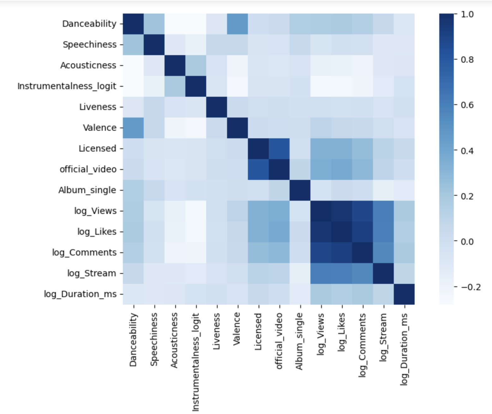
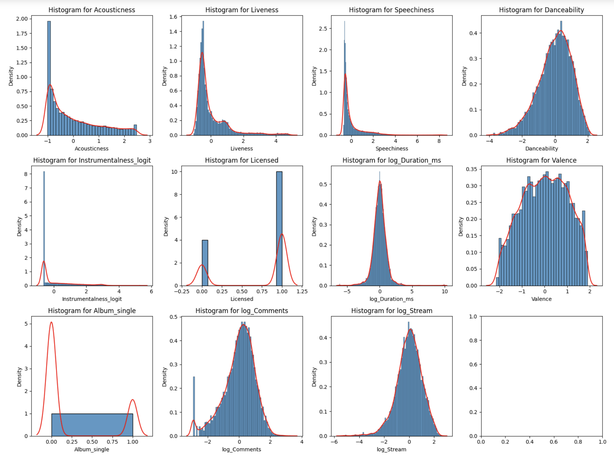
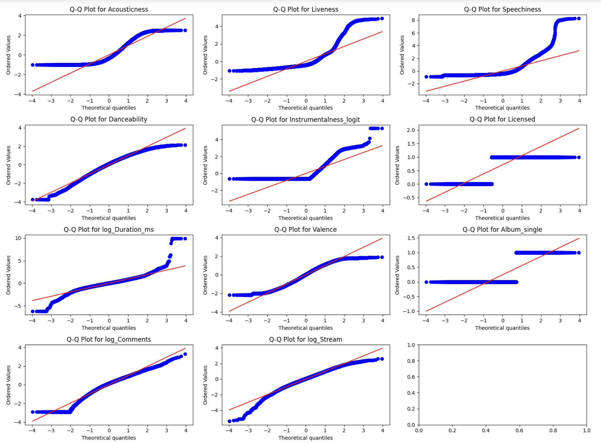
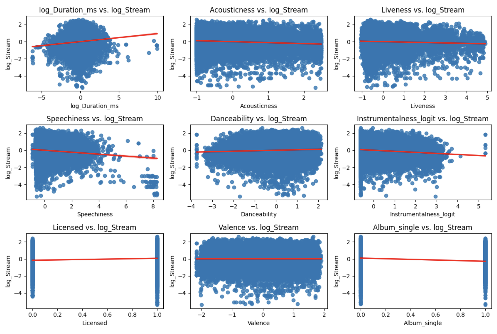
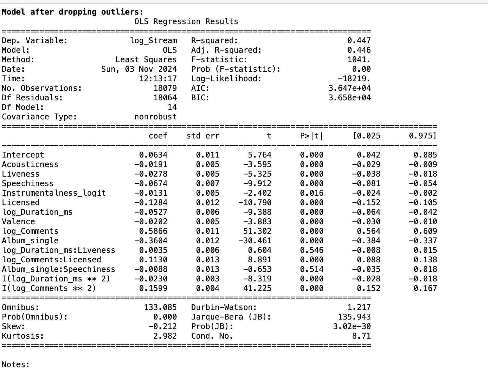
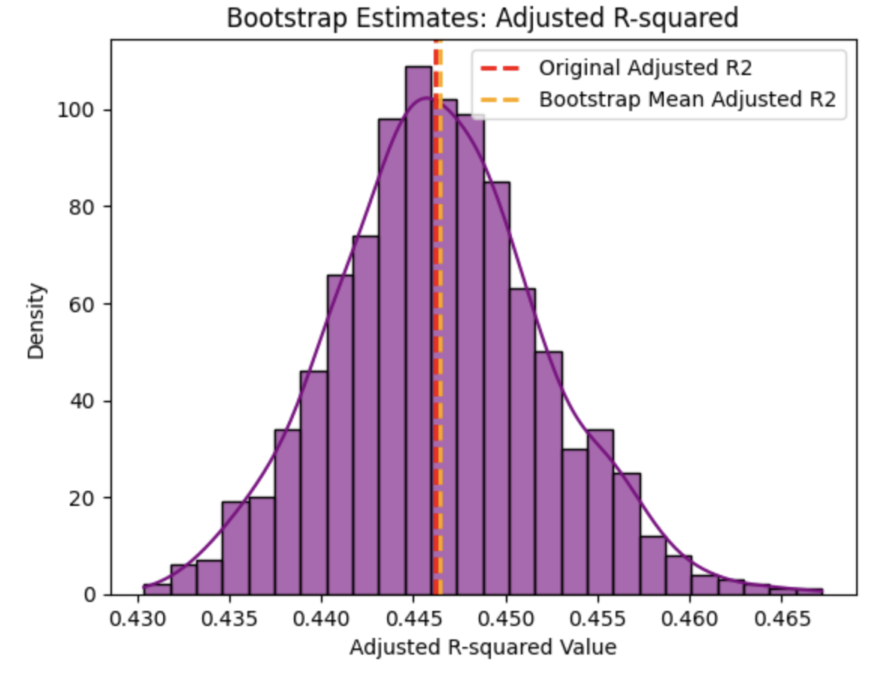
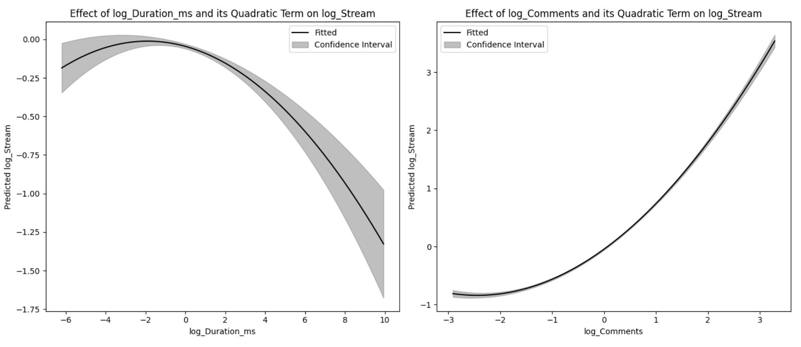

# Music Streams Prediction Model

This project aims to analyze and predict song popularity based on attributes from Spotify and YouTube data. By leveraging diverse musical, technical, and social metrics, we sought to uncover factors influencing a song’s popularity, represented by the number of streams on Spotify. 

## Project Overview

- **Objective**: Analyze 26 variables across songs, including attributes like energy, tempo, and social metrics, to determine the key factors affecting music popularity.
- **Data Source**: Spotify and YouTube datasets capturing both musical attributes and engagement metrics.

## Project Steps

### 1. Data Loading and Preprocessing     

- **Data Cleaning**: Handled missing values and reset indices after removal of nulls.
- **Feature Engineering**:
  - Created binary variables for categorical attributes like `Licensed` and `official_video`.
  - Transformed highly skewed variables (e.g., `Views`, `Likes`, `Comments`, `Stream`) using logarithmic transformations.
  - Standardized variables for uniform scale, essential for regression modeling.

### 2. Exploratory Data Analysis (EDA)

Key insights from EDA informed our understanding of the data distributions and correlations:

- **Correlation Heatmap**: Identified strong positive correlation between `Licensed` and `official_video`, suggesting possible redundancy.

     

- **Histogram and Density Plots**: Provided insights into data distributions for variables such as `Acousticness`, `Liveness`, and `Speechiness`.

     

- **Q-Q Plots**: Examined the normality of various features to assess their distribution characteristics.

     

- **Scatter Plots**: Assessed linearity between `log_Stream` and key predictors, highlighting non-linear patterns for many variables.
  
     

### 3. Feature Selection

To determine the most impactful features for predicting `log_Stream`, we used three main approaches:

1. **Boruta SHAP**: A feature ranking algorithm that leverages SHAP values to identify important variables based on feature importance.
2. **Variance Inflation Factor (VIF)**: Assessed multicollinearity among predictors. High VIF values indicate strong collinearity with other features, leading us to remove certain variables to enhance model stability.
3. **ANOVA**: Conducted to evaluate the significance of categorical variables in predicting `log_Stream` by examining F-values. The lower the p-value, the more significant the variable is in explaining variability in the target.

#### Selected Features
 
  - Variables with a VIF score above 10, such as `log_Likes` and `log_Views`, were excluded due to high multicollinearity.

  - The Boruta SHAP algorithm highlighted variables with a ranking of 1 as the most important, such as `Danceability`, `log_Duration_ms`, and `log_Comments`.

 -  ANOVA results show that `Album_single` and `Licensed` were more statistically significant in predicting `log_Stream`, with `Album_single` having the highest F-statistic. `Offical_Video` was dropped to resolve multicollinearity with `Licensed`.

### 4. Model Development

In developing a regression model to predict `log_Stream`, we explored various model iterations, including the use of Mallows' \( C_p \) criterion to guide model selection. Mallows' \( C_p \) is a model selection statistic that helps identify models that provide a good balance between accuracy and simplicity. Lower \( C_p \) values indicate models that are closer to the true model, with minimal bias and variance.

#### Step-by-Step Process

1. **Baseline Model**:
   - We ran a regression of all the selected variables and applied Mallows' \( C_p \) criterion to select our baseline model. This model included only the key features identified through Boruta SHAP and VIF analysis.
   - The baseline model served as a foundation for comparison, allowing us to assess potential improvements by introducing interaction and quadratic terms.
     
   - **Formula of the Baseline Model**:
     
     ```
     log_Stream = β₀ + β₁ * Acousticness + β₂ * Liveness + β₃ * Speechiness 
                  + β₄ * Instrumentalness_logit + β₅ * Licensed 
                  + β₆ * log_Duration_ms + β₇ * Valence 
                  + β₈ * log_Comments + β₉ * Album_single + ε
     ```

     where:
     - `β₀` is the intercept.
     - `β₁, β₂, ..., β₉` are coefficients for each predictor.
     - `ε` is the error term.

   - Initial metrics:
     - **R-squared**: 28.3%
     - **Adjusted R-squared**: 27.6%
     - **Mallows' \( C_p \)**: Higher than optimal, suggesting further refinements were needed.

2. **Adding Interaction Terms**:
   - Interaction terms were introduced to capture the combined effects of specific pairs of predictors on `log_Stream`.
   - **Tested Interactions**:
     - `log_Duration_ms * Liveness`
     - `log_Comments * Licensed`
     - `Album_single * Speechiness`
   - **Evaluation**:
     - Each interaction term was evaluated individually using Mallows' \( C_p \), with lower \( C_p \) values indicating improved fit.
     - `log_Duration_ms * Liveness` and `log_Comments * Licensed` were significant and reduced \( C_p \), enhancing the model's explanatory power.
     - **Updated Formula**:

       ```
       log_Stream = β₀ + β₁ * Acousticness + β₂ * Liveness + β₃ * Speechiness 
                   + β₄ * Instrumentalness_logit + β₅ * Licensed 
                   + β₆ * log_Duration_ms + β₇ * Valence 
                   + β₈ * log_Comments + β₉ * Album_single 
                   + β₁₀ * (log_Duration_ms * Liveness) 
                   + β₁₁ * (log_Comments * Licensed) 
                   + β₁₂ * (Album_single * Speechiness) + ε
       ```

3. **Adding Quadratic Terms**:
   - Quadratic terms were added to account for non-linear relationships between certain predictors and `log_Stream`.
   - **Tested Quadratic Terms**:
     - `log_Duration_ms^2`
     - `log_Comments^2`
   - **Evaluation**:
     - Including `log_Duration_ms^2` and `log_Comments^2` further reduced Mallows' \( C_p \) and improved model fit, indicating that moderate values of these variables were optimal for popularity.
     - **Final Formula**:

       ```
       log_Stream = β₀ + β₁ * Acousticness + β₂ * Liveness + β₃ * Speechiness 
             + β₄ * Instrumentalness_logit + β₅ * Licensed 
             + β₆ * log_Duration_ms + β₇ * Valence 
             + β₈ * log_Comments + β₉ * Album_single 
             + β₁₀ * (log_Duration_ms * Liveness) 
             + β₁₁ * (log_Comments * Licensed) 
             + β₁₂ * (Album_single * Speechiness) 
             + β₁₃ * (log_Duration_ms)^2 
             + β₁₄ * (log_Comments)^2 + ε
       ```




#### Final Model Performance
- **R-squared**: 34.5%, indicating that the model explains 34.5% of the variance in `log_Stream`.
- **Adjusted R-squared**: 33.8%, confirming that the model maintains explanatory power without overfitting.
- **F-statistic**: High significance level (p < 0.001), confirming the overall reliability of the model.

- **Bootstrap Estimates of Adjusted R-squared**: To validate the stability of the adjusted R-squared, we performed bootstrap sampling. The histogram below shows the distribution of adjusted R-squared values across bootstrap samples, with the red line representing the original adjusted R-squared value and the yellow line indicating the bootstrap mean adjusted R-squared. This analysis further supports the robustness of the model.

     

#### Model Coefficients and Interpretation
The final model coefficients showed notable associations with `log_Stream`:

- **Positive Associations**:
  - `log_Comments`: Higher values are associated with increased stream counts, emphasizing the impact of social engagement.
  - `log_Duration_ms`: Longer song durations have a positive effect on streams.
  - **Interaction** (`log_Duration_ms * Liveness`): Indicates that songs with higher liveness benefit even more from longer durations.

- **Curvature Effects**:
  - `log_Duration_ms^2` and `log_Comments^2`: These quadratic terms reveal a non-linear relationship with `log_Stream`, where moderate values of `log_Duration_ms` are associated with higher stream counts, while `log_Comments` shows a consistently positive trend with increasing values, indicating that higher comment engagement significantly boosts popularity.

     

The final model provides a robust and interpretable framework for predicting song popularity on Spotify, balancing simplicity with predictive power.
