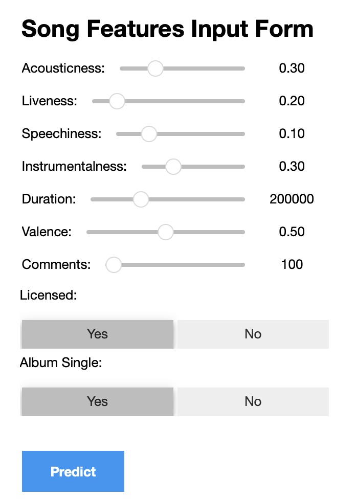

## [Streams Prediction Calculator Demo](https://youtu.be/171_75nwfGY) 

This demo showcases the functionality of the Streams Prediction Calculator, an interactive tool designed to estimate music streaming numbers based on key features such as energy, danceability, and audience engagement. By leveraging a regression-based machine learning model hosted in the cloud, the calculator provides real-time predictions through a user-friendly interface.

## Tools and Technologies Used

