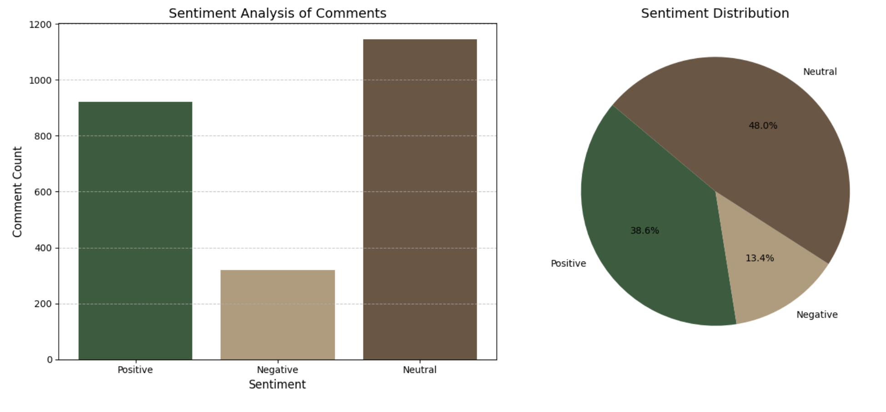
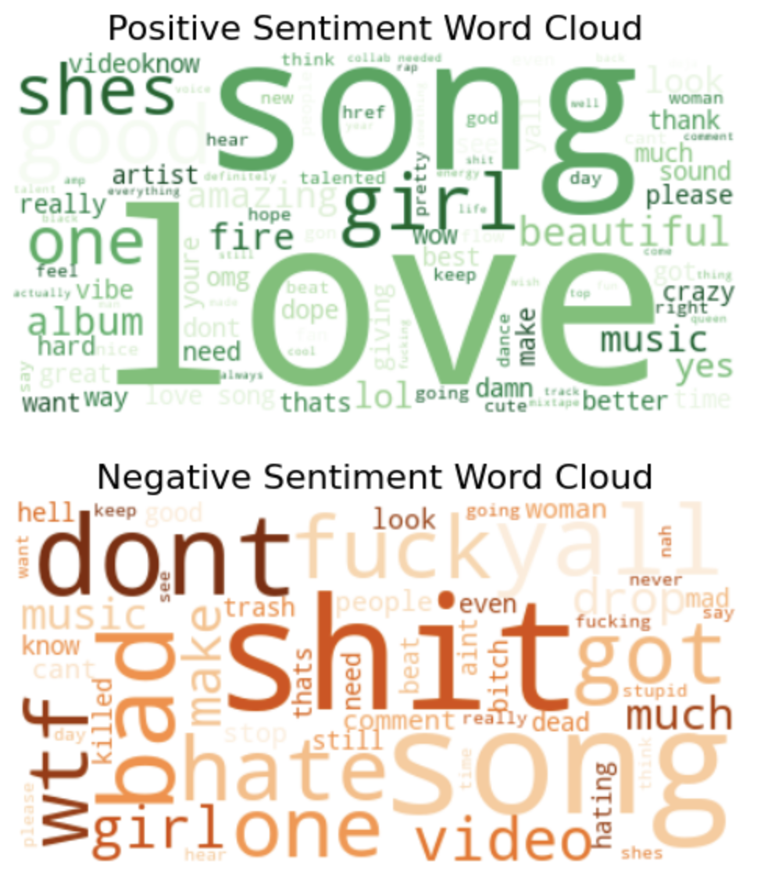
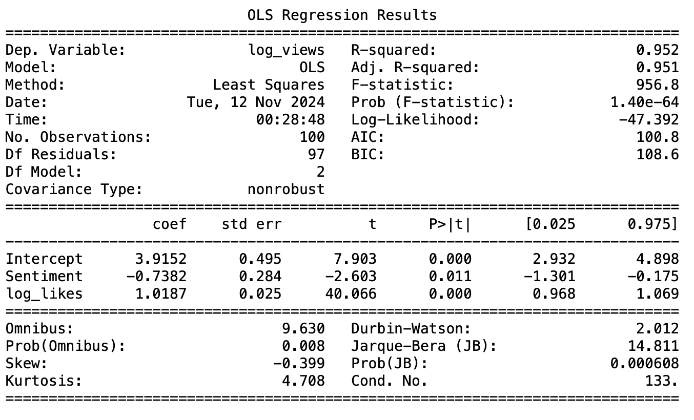

# Doechii YouTube Comment Sentiment Analysis

This project analyzes the sentiment of comments on Doechii's YouTube music videos, aiming to uncover audience engagement and predict view counts based on sentiment patterns. By applying natural language processing (NLP) techniques and regression modeling, this project provides insights into fan sentiment and its potential impact on video performance.

## Project Overview

- **Objective**: 
   - Analyze the sentiment of YouTube comments to understand the audience's emotional response to Doechii's videos.
   - Leverage sentiment scores and engagement metrics to predict video view counts.
- **Data Source**: 
   - YouTube comments and metadata from Doechii's official YouTube channel.

## Project Steps

### 1. Data Collection and Preprocessing

   - **Data Collection**: Extracted YouTube comments, likes, views, and other engagement metrics from Doechii's channel.
   - **Text Cleaning**: Removed emojis, URLs, special characters, and normalized text to enhance sentiment analysis accuracy.

### 2. Sentiment Analysis

   - Used the VADER sentiment analysis tool to score comments as Positive, Neutral, or Negative.
   - Customized VADER's lexicon to accurately capture slang and expressions common in fan comments.

   
   

### 3. Visualizing Sentiment

   - **Sentiment Distribution**: Illustrated the distribution of positive, neutral, and negative comments.
   - **Word Clouds**: Created word clouds for positive and negative sentiments, highlighting common themes in fan feedback.
   
   
   

### 4. Regression Analysis

   - Performed a regression analysis using sentiment scores and engagement metrics (likes, comments) to predict video view counts.
   - Results indicate a significant relationship between sentiment and video performance, emphasizing the impact of audience perception on engagement.

## Conclusion

This analysis highlights the role of sentiment in understanding audience engagement with Doechii's content. By combining sentiment analysis with regression modeling, we gain actionable insights into how fans perceive Doechii's music and how this influences viewership trends.

